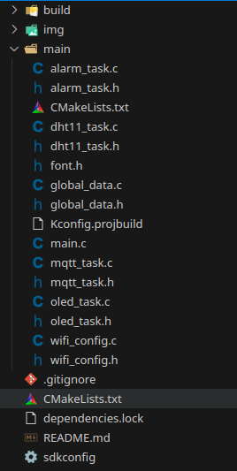
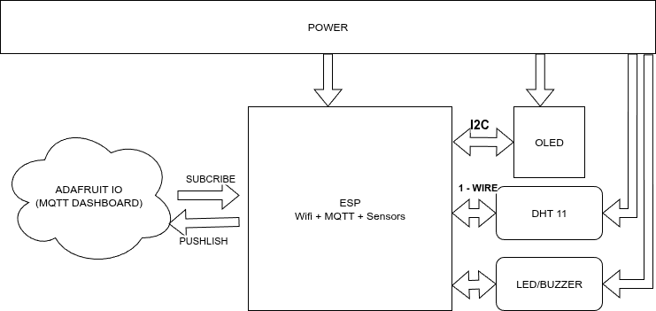
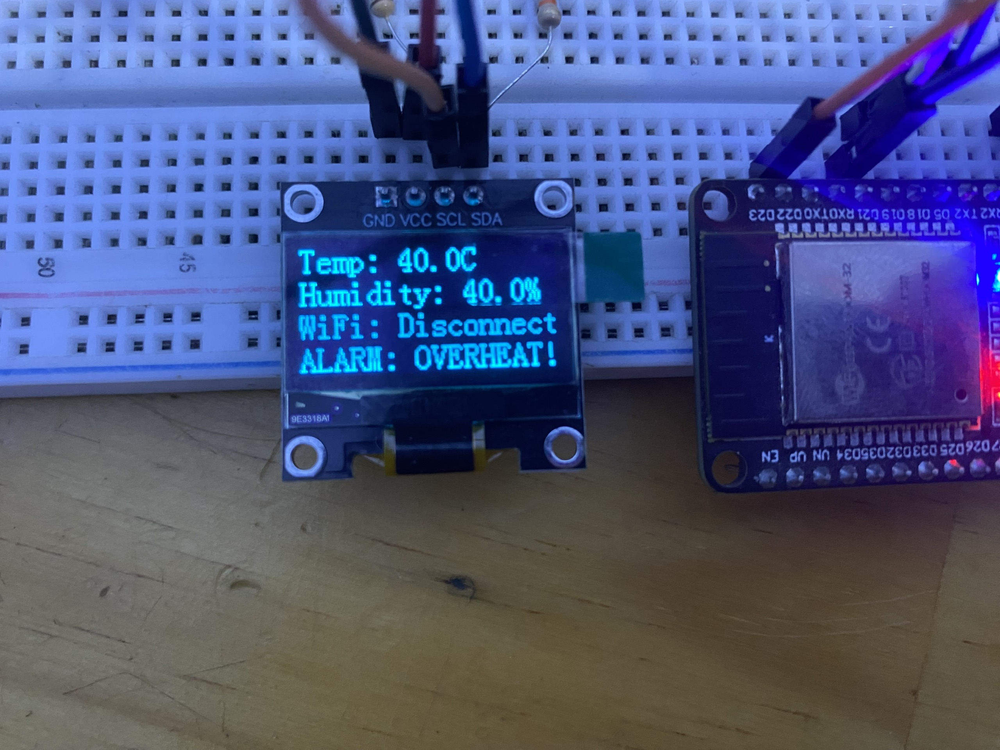
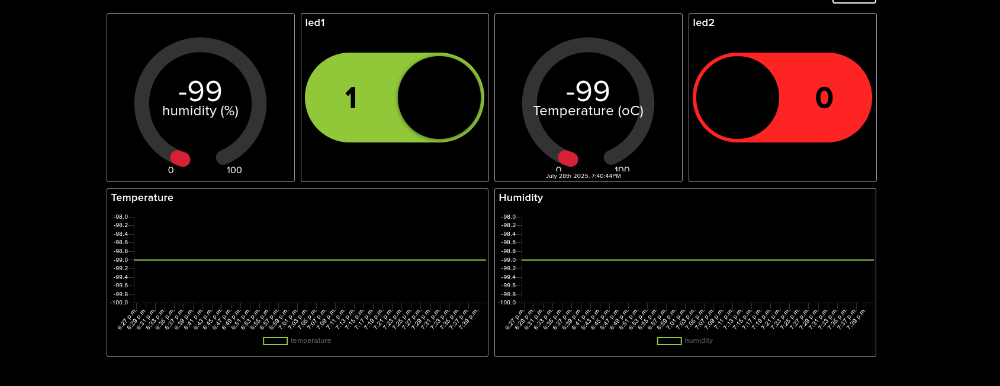

# 🌐 SYSTEM IoT: Temperature & Humidity Monitoring with Remote LED Control (ESP32 + MQTT)

## 📌 Project Title  
IoT-Based Environment Monitoring and Remote LED Control Using ESP32, DHT11, MQTT, and OLED

---

## 📖 Description  
This project uses an **ESP32** board, a **DHT11 sensor**, an **OLED SSD1306 display**, and the **MQTT protocol** (via Adafruit IO) to collect temperature and humidity data and control LED output remotely. The data is updated in real time and shown on both the OLED screen and an online dashboard.

---

## 🛠️ How to Use

### 🔧 Requirements:
- **ESP-IDF v4.4.4**: [Link](https://github.com/espressif/esp-idf/releases/tag/v4.4.4)
- **MQTT Broker**: [Adafruit IO](https://io.adafruit.com/)
- **Hardware**:
  - ESP32 DevKit
  - DHT11 sensor
  - OLED SSD1306 (I2C)
  - 2 LEDs + resistors
  - Buzzer
  - Wires + Res + breadboard

### 📊 Dashboard (Adafruit IO):
Create 4 feeds:
- `temperature`
- `humidity`
- `led1`
- `led2`

Then build a dashboard with:
- 2 buttons to control `led1`, `led2`
- 2 text blocks to show temperature and humidity

---

## 📁 Project Structure
<div align="center">

</div>

---

## 🧩 Hardware Connections

| Device     | ESP32 GPIO |
|------------|------------|
| DHT11 DATA | GPIO4      |
| OLED SDA   | GPIO21     |
| OLED SCL   | GPIO22     |
| LED1       | GPIO18     |
| LED2       | GPIO19     |
| Buzzer     | GPIO2      |

- DHT11, OLED SCL and OLED SDA needs a 10kΩ pull-up resistor on the DATA pin  
- All devices powered by 3.3V from ESP32

---

## 🌐 MQTT Feed Overview

| Feed        | Type       | Purpose                      |
|-------------|------------|------------------------------|
| temperature | Publish    | Send temperature value       |
| humidity    | Publish    | Send humidity value          |
| led1        | Subscribe  | Receive LED1 control         |
| led2        | Subscribe  | Receive LED2 control         |

- Broker URI: `mqtt://io.adafruit.com`  
- Username: `Phong74R5`  
- AIO Key: *(keep private)*

---

## 🔁 System Behavior

- Connects to Wi-Fi automatically
- Enter Wi-Fi name and password using UART
- Reads temperature and humidity every 2 seconds
- Sends data to MQTT every 10 seconds
- Receives LED control commands from dashboard
- Displays all information on OLED
- Shows warning when temperature is too high, the buzzer will sound

---

## 📈 Functional Diagram
<div align="center">
  
</div>

---

## 📺 Example Output

### OLED Display
<div align="center">
  
</div>

### Terminal Log
```log
I (20341) MQTT_TASK: Published: Temp=28.6, Humi=65.0
I (20400) MQTT_TASK: Received on topic: led1 | data: 1
I (20401) MQTT_TASK: LED1 set to: 1
```
### Dashboard
<div align="center">
  
</div>

---
## System Protection

- **Wi-Fi lost** → MQTT task stops automatically  
- **DHT11 error** → warning is shown, value set to `-99`, not sent  
- **Reconnect MQTT** → LEDs re-synced with dashboard  

---

## 🔌 I/O Summary

| Signal         | Type     | Description                         |
|----------------|----------|-------------------------------------|
| `temperature`    | Output   | From DHT11 to MQTT and OLED         |
| `humidity`       | Output   | From DHT11 to MQTT and OLED         |
| `led1_state`     | Input    | LED1 control from Adafruit IO       |
| `led2_state`     | Input    | LED2 control from Adafruit IO       |
| `wifi_connected` | Flag     | Wi-Fi connection status             |

---

## ✅ Result Summary

- ✅ Sensor readings are **stable and accurate**
- ✅ MQTT communication is **fast and reliable**
- ✅ Remote LED control works **smoothly**
- ✅ OLED shows **real-time data clearly**
- ✅ Logs are **clear and useful for debugging**

---

## 👤 Author

**Lê Hồng Phong – 22119210**  
Faculty of Electrical-Electronics, HCMUTE  
📧 Email: lehongphong@gmail.com
